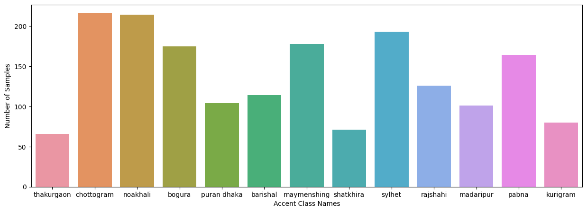
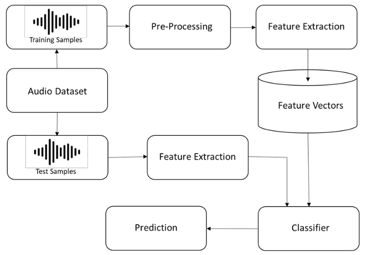
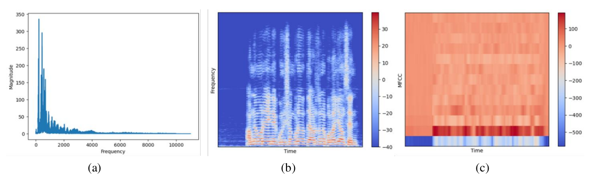
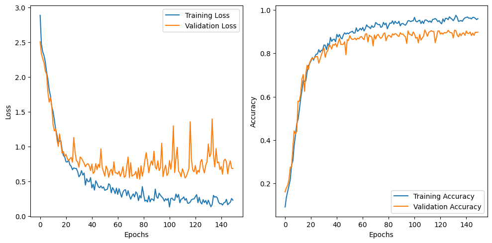
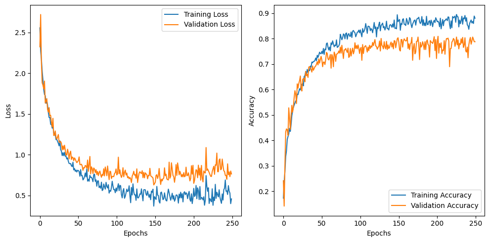
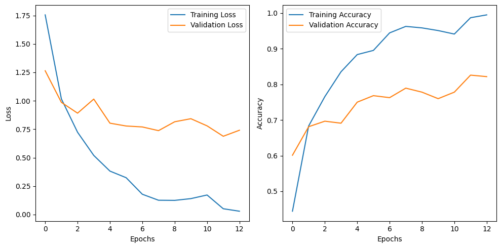
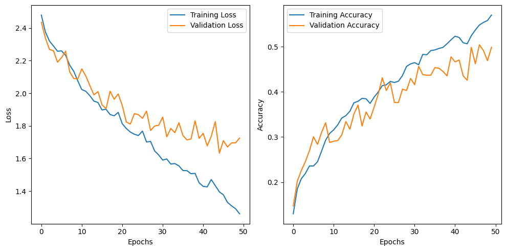
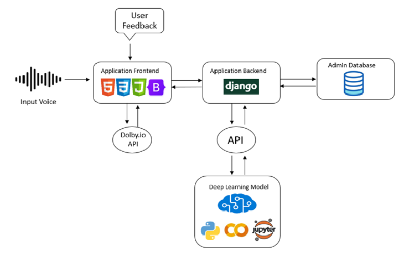

# Title: Efficient Classification of Spoken Bengali Accent Using Deep Learning

**A brief description of what this project does and who it's for**

Accent classification is a crucial task in natural language processing
that aims to automatically identify the accent class that is expressed in voice.
This paper focuses on utilizing deep learning techniques to perform accent
classification and explore the effectiveness of various algorithms in accurately
predicting accents. In order to make the idea successful, the first and foremost
thing to be done is to find a dataset that is appropriate for the idea. We have used suitable dataset which contain human voices from different part of Bangladesh. But we couldn't find any. That's why we have started creating our own dataset. There are several methods we have followed in order to create the dataset. Initially we targeted the YouTube videos where people speak in their regional accent. We have used Audacity software to create voice clip. But we realize that it is not enough to create a robust dataset. Then we decided to collect samples from people by recording their voice. We have collected around total 2000 voice samples for thirteen accents. As normal voice recordings contain various noises thus, we have cleaned audio clips with AI Audio Denoising tools. Then Librosa library is used to extract features from audio. We have also applied augmentation on the audio features. This is a very powerful technique that helps model to learn robust features. We have built Artificial Neural Network (ANN) and trained it with the audio features. We have got 97.55% of maximum training accuracy and 90.80% of maximum validation accuracy. Then we fitted the same features into a CNN1D network and we got 89.10% of maximum training accuracy and 80.62% of maximum validation accuracy. CNN2D network has outperformed CNN1D with maximum training accuracy of 98.69% and validation accuracy of 82.58%. On the other hand, LSTM shows the lowest training and validation accuracy of 57.00% and 49.86%. Among these four models, ANN produced state-of-the-art result outperforming other models in every index.

## Table of contents
* [Dataset Creation](##datasetcreation)
* [System Design](##systemdesign)
    * [Data Preprocessing](###datapreprocessing)
    * [Feature Extraction](###featureextraction)
    * [Data Augmentation](###dataaugmentation)
* [Modeling and Results](##modelingandresults)
* [Integration with Application](##integrationwithapplication)
* [Application Demo](##applicationdemo)
* [Installation Process](##installationprocess)
* [Technologies Used](##technologiesused)
* [FAQ](##faq)


## Dataset Creation
In order to achieve the objectives identified through extensive research, we determined the need for a comprehensive dataset. To address this, we initiated the process of creating our own dataset, focusing on the collection of 2,000 audio samples from diverse regions across Bangladesh. Data acquisition was carried out through multiple channels, including social media platforms such as Facebook and YouTube, as well as direct recordings from individuals at our university and various regions of the country. Ultimately, we successfully met our target, obtaining 2,000 audio samples from 13 distinct regions of Bangladesh.

<div align="center">
    <a href="">
      
    </a>
</div>

## System Design
The diagram outlines an audio classification pipeline starting with an audio dataset split into training and test samples. Training samples undergo pre-processing (e.g., noise reduction), followed by feature extraction to generate feature vectors. These vectors are used to train a classifier. Test samples skip pre-processing, go directly to feature extraction, and the extracted features are input into the trained classifier for prediction. This process converts raw audio into numerical representations for efficient classification.

<div align="center">
    <a href="">
      
    </a>
</div>

#### Data Preprocessing
Preprocessing is a critical phase that involves in-depth analysis of the audio dataset to extract meaningful insights, which inform the subsequent stages of the pipeline. One of the key tasks in this phase is to enhance audio quality by cleaning the audio clips, including the removal of noise and irrelevant sounds. Additionally, large audio files must be segmented into shorter, more manageable clips to facilitate efficient processing. For noise reduction, [Adobe Podcast](https://podcast.adobe.com/enhance) was employed, providing advanced capabilities to ensure clarity in the audio data. Meanwhile, [Audacity](https://www.audacityteam.org/) was used for splitting the audio files into smaller segments, enabling more precise feature extraction and model training in the later stages of the workflow. These preprocessing steps were essential for preparing the dataset for feature extraction and subsequent classification.

#### Feature Extraction
The figure (a) shows that the most of the magnitude consists in the lower range of the frequency and lesser amount of magnitude consists in the range of the rest of the frequency. Through spectrogram analysis we can see in figure (b) that it also states that the most of the energy consists in the lower frequency. The spectrogram remains stable throughout time. The figure (c) showing the MFCCs throughout time. There are 13 intervals in this spectrogram. The interval represents the coefficients. We basically seeing here that how different MFCCs evolving over time.

<div align="center">
    <a href="">
      
    </a>
</div>

The EDA concludes that MFCC feature is more useful. We have used `librosa` library to extract MFCC feature from audio. The feature map size we used is 128. We have tested several feature map of 40, 60 size and found out the optimal size 128.

#### Data Augmentation
In order to train a model efficiently we have to provide it with scalable audio data. The more audio sample we pass into the model, the more the model will gain generalization capability. To achieve this, we have incorporated data augmentation. By applying this we have able to create more audio samples. These samples are slightly shifted version of the actual datapoints, which will able to help model learn different features. These are the types of augmentation techniques that we have used:

- Gaussian Noise Addition
- Pitch Scaling
- Invert Polarity
- Random Gain

## Modeling and Results
The deep learning models used in this study include Artificial Neural Networks (ANN), CNN1D, CNN2D, and LSTM. Each model was trained to classify Bengali accents after feature extraction and preprocessing. The ANN model demonstrated the best performance among the models tested, while CNN2D showed potential overfitting issues. CNN1D provided moderate results, and LSTM struggled significantly compared to the other models.

Below is the table containing the list of hyperparameters and their values.

<center>

| Model Name    | Learning Rate |   &#946;1  |   &#946;2    |
| :-----------: | :-----------: | :---------:| :-----------: |
| ANN           | 0.0008        |     0.9    |    0.999      |
| CNN1D         | 0.001         |     0.9    |    0.999      |
| CNN2D         | 0.001         |     0.9    |    0.999      |
| LSTM          | 0.001         |     0.9    |    0.999      |

</center>

These are the training curves of four models.

<div align="center">
    <a href=""></a>
    <a href=""></a>
    <a href=""></a>
    <a href=""></a>
</div>

In terms of results, the ANN model achieved a training accuracy of 97.55% and a validation accuracy of 90.80%, making it the top-performing model. The CNN2D model exhibited a high training accuracy of 98.69% but had a lower validation accuracy of 82.58%. CNN1D achieved training and validation accuracies of 89.10% and 80.62%, respectively. In contrast, LSTM underperformed, with a training accuracy of 57.00% and a validation accuracy of 49.86%. Overall, the ANN model outperformed the others, delivering state-of-the-art results for Bengali accent classification.

Here is the table showing evaluation parameter values for each model.
<center>

| Network | Training Accuracy | Test Accuracy | Precision |  Recall  | F1-Score |
|:-------:|:----------------: |:-------------:|:---------:|:--------:|:--------:|
|  ANN    |       97.55       |     90.80     |  0.9097   |  0.9080  |  0.9076  |
| CNN1D   |       89.10       |     80.62     |  0.8213   |  0.7879  |  0.7959  |
| CNN2D   |       98.69       |     82.58     |  0.8258   |  0.8216  |  0.8212  |
| LSTM    |       57.00       |     49.86     |  0.5038   |  0.4985  |  0.4876  |

</center>

## Integration with Application
We have saved the trained model and loaded back into our django application. We have also used Dolby.io api for audio enhancement. This api is build using NodeJs. There are two ways to intaract with our model, first one is to use realtime recording and pass to the model for prediction and the second way is to upload a recording for prediction. The model then will generate prediction probabilities for each classes and this information will be displayed in a bar chart. There is a feature for user to submit their feedback on the models response. If there feedback is matched with the models prediction that it will be considered as a correct prediction.

<div align="center">
    <a href="">
      
    </a>
</div>

## Application Demo
Here is a short video to demonstrate our application in action.

[](http://www.youtube.com/watch?v=lKkuzOgjCFg)

## Installation Process
In order to run this application you just need to clone this repository, create an python enviroment and install the requirements.

Command for creating and activating python environment. You can use different ways to create your environment.
```python
conda create -n <env_name>
conda activate <env_name>
```

Execute the following command for installing the required libraries.
```python
pip install -r requirements.txt
```

Now, we are all setup for running the application. First open two command prompt and navigate to `audio-recording-backend` and `bangla_accent_detection` folder respectively. Then run the following command respectievely.

```python
node app.js
```
```python
python manage.py runserver
```

## Technologies Used
We have used several python libraries and frameworks for different purposes.

- [pandas, numpy, matplotlib, searborn] - These are used for exploratory data analysis.
- [librosa] - It is used for extracting MFCC features from the audio and applying data augmentation.
- [tensorflow, keras] - These two are machine learning frameworks equiped with tools to build neural network architectures.
- [scikit-learn] - We have used it in data preprocessing and result analysis. All the evaluation parameters values are produced with the help of this library.
- [django] - We have buid a web application to deploy our trained model.
- [HTML, CSS, Bootstrap] - Website frontend design.
- [nodejs] - For building audio enhancement api using Dolby.io. 

## FAQ

#### **Q: Is the dataset available open source?**
**A:** Currently we didn't open sourced the data yet. But it will be available in future.

## License
[MIT](LICENSE)
